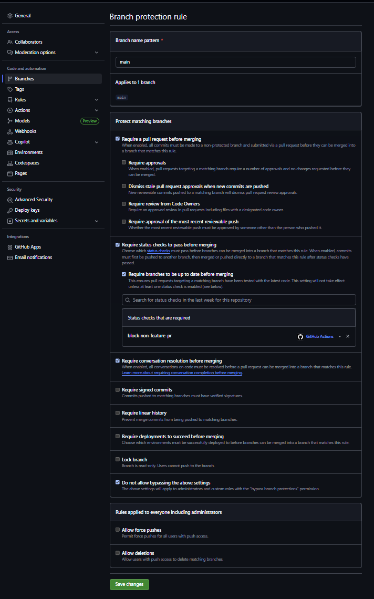

# GitHub Flow + development_check 運用ルール

## ブランチの役割

### main/master
- 本番環境用の長寿命ブランチ
- **直接 push 禁止**
- **PR 経由でのみマージ可能**
- 本番デプロイはここから実施

---

### feature/xxx
- 開発用の短寿命ブランチ
- **`main`** から派生
- 完成後は **まず `development_check` に PR**
- 動作確認後、問題なければ **`main` に PR**
- マージ後は削除

---

### development_check
- **テスト環境専用の長寿命ブランチ**
- **直接 push 禁止**
- **PR 経由でのみマージ可能**
- 新しいブランチをここから作らない
- 他のブランチへマージしない
- 常に「テスト環境用の最新版」を保持

### 禁止行為
- `master`または`main`の**直接 push 禁止**
- `develop`の**直接 push 禁止**
- `development_check`の**直接 push 禁止**
- **`PR` を経由**しないmerge

---

## 開発フロー

1. `main` から `feature/xxx` を作成
2. 開発 → PR を作成して `development_check` にマージ
3. テスト環境にデプロイして動作確認
4. 問題なければ **同じ `feature/xxx` を main へ PR 作成 → マージ**
5. 本番デプロイは `main` から
6. `feature/xxx` を削除

---

## `development_check`にMergeするときコンフリクトが発生した場合

1. `main`ブランチから`devcheck/xxx`ブランチを作成
2. `devcheck/xxx`ブランチに`feature/xxx`ブランチをmerge
3. `devcheck/xxx`ブランチからdevelopment_checkにPRを作成
4. GitHubのPR上で、コンフリクトを解消
5. リリースの際は`feature/xxx`から`main`に向けてPRを作成

---

## コミットメッセージのルール

bump-and-release.sh では以下の優先度でバージョン種別を判定します (major > minor > patch):
1. 本文に BREAKING CHANGE を含む もしくは ヘッダー行の型名後に ! が付く (例: feat!: / fix!: ) → major
2. ヘッダーが feat: または feat(scope): で始まる → minor
3. 上記以外 (fix:, docs:, chore:, style:, refactor:, perf:, test:, ci: など全て) → patch

| プレフィックス例 | 説明 | 付与されるバージョン増分 |
|------------------|------|--------------------------|
| BREAKING CHANGE (本文) | 後方互換性を壊す変更内容を本文で宣言 | major |
| feat!: ...        | 破壊的変更を伴う新機能 | major |
| feat: ...         | 新機能追加 | minor |
| feat(scope): ...  | スコープ付き新機能 | minor |
| fix: ...          | バグ修正 (欠陥の是正) | patch |
| docs: ...         | ドキュメントのみ変更 | patch |
| chore: ...        | ビルド/依存更新など雑務 (機能影響なし) | patch |
| style: ...        | コードスタイル (フォーマット/セミコロン等) | patch |
| refactor: ...     | 挙動を変えない内部改善 | patch |
| perf: ...         | パフォーマンス改善 | patch |
| test: ...         | テスト追加/修正 (本体非変更) | patch |
| ci: ...           | CI 定義/ワークフロー変更 | patch |
| build: ...        | ビルドシステム関連 (chore と分離したい場合) | patch |
| revert: ...       | 以前のコミット取り消し | patch |
| security: ...     | セキュリティ修正 (緊急性を明示) | patch |
| deps: ...         | 依存ライブラリ更新 (chore 派生) | patch |
| その他 (未定義の型) | 上記以外すべて | patch |

### 例
- feat: add search API → minor (v1.2.3 → v1.3.0)
- feat!: remove legacy auth → major (v1.2.3 → v2.0.0)
- fix: prevent null pointer → patch (v1.2.3 → v1.2.4)
- docs: update usage guide → patch
- refactor: split service layer → patch

### コミットテンプレートの設定方法

```bash
git config commit.template .github/commit-template.txt
```

---

# ブランチ保護設定（main/development_check）



